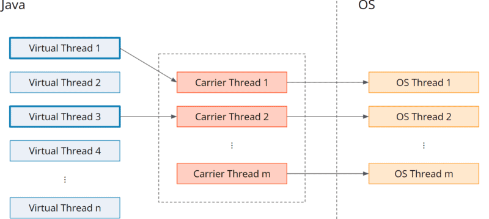

# Project Loom

Desde el principio, – atrás a 1997 -, Java proporcionó una manera fácil de trabajar con aplicaciones de multithread, hablamos de la clase Thread y la interfaz Runnable. Con las nuevas versiones de Java, el JDK incluía más formas de simplificar el trabajo con concurrencia en Java. Por ejemplo: el Executor Service, ForkJoinPool, Future, CompletableFuture, el parallel Stream, el paquete java.concurrent.* con colecciones, utilidades, bloqueos y más.

Todas esas características hacen de Java un ecosistema rico para trabajar con aplicaciones multihilos, sin embargo, se han limitado a los hilos del sistema operativo. En aplicaciones grandes con cientos de procesos simultáneos, es posible que no sea lo suficientemente eficiente y que no se escale fácilmente, lo que requiere agregar más CPU para proporcionar más hilos disponibles. Esto se debe principalmente al modelo de simultaneidad de estado compartido que se usa de forma predeterminada.

Es por eso que Project Loom comenzó en 2017, y es una iniciativa para proporcionar hilos livianos que no están vinculados a los Procesos del sistema operativo, pero que son administrados por JVM. Oficialmente en la version 21.

## Threads Virtuales

Los threads virtuales son hilos livianos que no están vinculados a los hilos del sistema operativo, sino que son administrados por la JVM. Son adecuados para los estilos de programación de thread per request sin tener las limitaciones de los hilos del sistema operativo. Puede crear millones de hilos virtuales sin afectar el rendimiento. Esto es bastante similar a las corrutinas, como las goroutines, que se hicieron famosas gracias al lenguaje de programación Go (Golang).

Los hilos virtuales resuelven el problema de una manera que nos permite escribir código fácil de leer y mantener. Los hilos virtuales parecen hilos normales desde la perspectiva del código Java, pero no están asignados 1:1 a los hilos del sistema operativo.

En cambio, existe un grupo de los llamados hilos portadores en los que se asigna temporalmente un hilo virtual ("se monta"). Tan pronto como el hilo virtual encuentra una operación de bloqueo, se lo elimina ("se lo desmonta") del hilo portador y este puede ejecutar otro hilo virtual (uno nuevo o uno previamente bloqueado).

La siguiente figura muestra esta asignación M:N de hilos virtuales a hilos portadores y, por lo tanto, a hilos del sistema operativo:

El grupo de hilos portadores es un ForkJoinPool, es decir, un grupo en el que cada hilo tiene su propia cola y “roba” tareas de las colas de otros hilos si su propia cola está vacía. Su tamaño se establece de forma predeterminada en Runtime.getRuntime().availableProcessors() y se puede ajustar con la opción de VM jdk.virtualThreadScheduler.parallelism.

### Consideraciones

Hay consideraciones sobre el uso de threads virtuales en lugar de threads de plataforma.

- Cuando se usan tareas extensas de CPU, es mejor usar hilos de plataforma. Debido a que los hilos virtuales aprovechan el tiempo de inactividad de la CPU (como suspensión, conexiones de E/S, etc.) para cambiar y ejecutar otros hilos en el mismo trabajador, pero con tareas extensas de la CPU, no hay tiempo de inactividad, la CPU siempre está ocupada.
- Use thread virtuales, cuando la tarea se trata más de hacer alguna otra lógica, como conectar otro servicio, solicitud http, conexión de socket, mover datos entre objetos, etc.

## Concurrencia estructurada

La concurrencia estructurada tiene como objetivo simplificar la programación paralela y multiproceso. Trata varias tareas que se ejecutan en diferentes hilos como una sola unidad de trabajo, lo que agiliza el manejo y la cancelación de errores y, al mismo tiempo, mejora la confiabilidad y la observabilidad. Esto ayuda a evitar problemas como fugas de hilo y demoras en la cancelación. Al ser una característica de incubación, es posible que experimente más cambios durante la estabilización.

